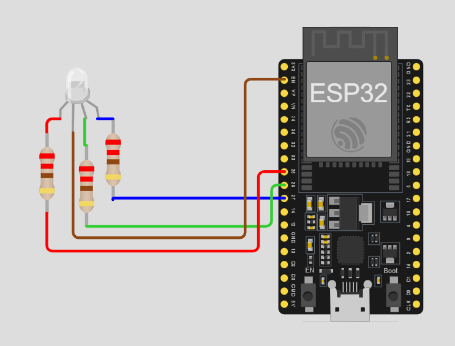

# ESP32-005-Mood-Light-with-ESP32
A simple project to control a 4-pin RGB LED using an ESP32. By adjusting the GPIO outputs and resistor values, you can create different colors and lighting effects. Great for beginners to learn about PWM, GPIO control, and LED color mixing.

---

## 🛠 Components Required

1. [ESP32 Development Board (30-pin)](https://robocraze.com/products/nodemcu-32-wifi-bluetooth-esp32-development-board30-pin?_pos=3&_psq=ESP32&_ss=e&_v=1.0)
2. [4-Pin RGB LED (Common Anode)](https://robocraze.com/products/rgb-led-common-anode-pack-of-10?_pos=7&_psq=RGB+LED&_ss=e&_v=1.0)
3. [220Ω Resistors (Pack of 10)](https://robocraze.com/products/220-ohm-resistor-pack-of-10?_pos=1&_psq=220&_ss=e&_v=1.0)
4. [Breadboard](https://robocraze.com/products/breadboard?_pos=3&_psq=BREADBOARD&_ss=e&_v=1.0)
5. [Jumper Wires (Male-to-Female, 20cm, 40pcs)](https://robocraze.com/products/f2m-jumper-wires-20cm-40pcs?_pos=1&_psq=JUMPER+WIRES&_ss=e&_v=1.0)

---

## 🎥 Project Demo

* Instagram Reel 👉 [Watch Here](https://www.instagram.com/reel/DN8LouSkxdZ/?igsh=b2FkcG83ZjE4cTBj)

---

## Circuit Diagram

